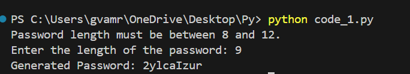

# Password Generator 🔐

This is a **Python-based Password Generator** that creates secure and random passwords based on user-defined criteria.

## Features 🚀
- Generates **strong and random passwords**
- Allows customization of:
  - Password length
  - Inclusion of uppercase letters, lowercase letters, numbers, and special characters
- Uses Python's `random` and `string` modules for security
- Simple command-line interface (CLI) implementation

## Installation & Usage ⚡
1. Clone the repository:
   ```bash
   git clone https://github.com/pranathi-vnr/Password_Generator.git
   cd Password_Generator
2.Run:
   python password_generator.py
   
## Screenshot 📸
### Generated Password Output

